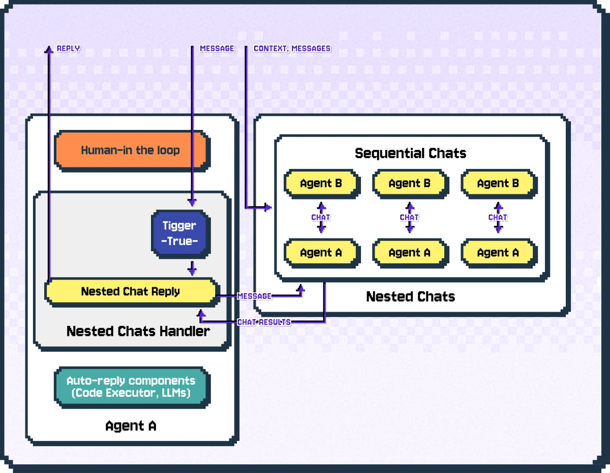
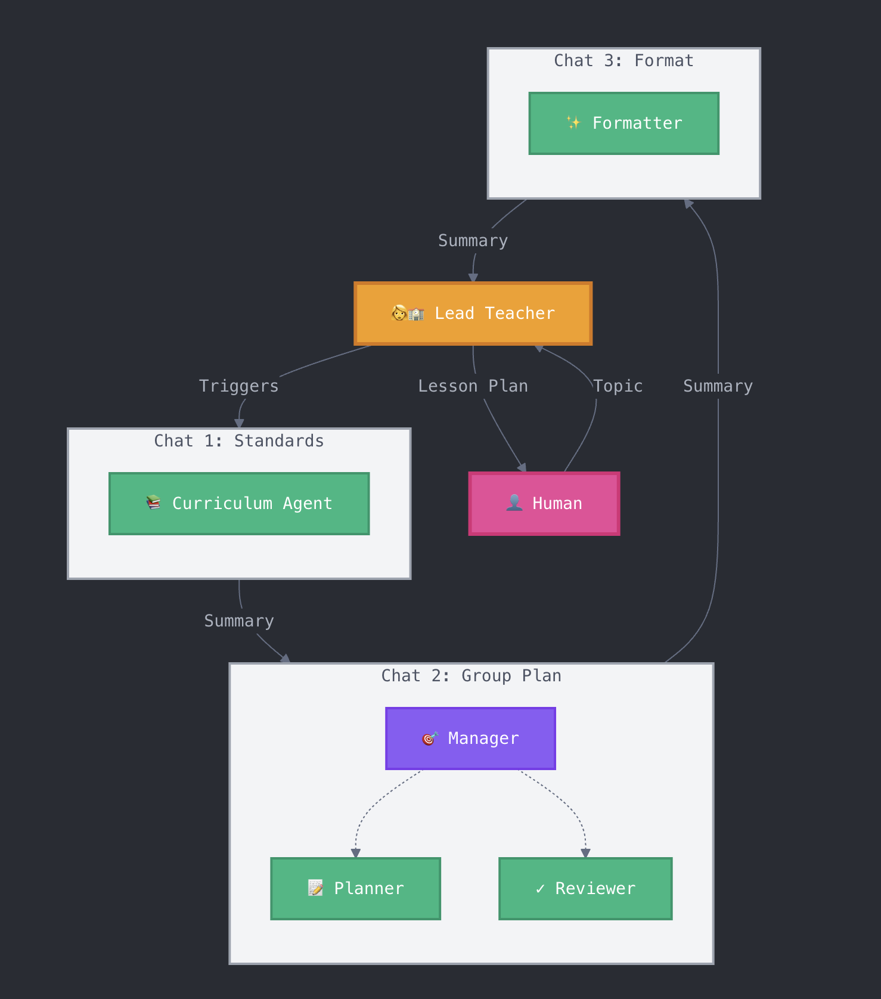

!!! example "Try it on the AG2 Playground"
    See nested chat live at [playground.ag2.ai](https://playground.ag2.ai){:target="_blank"} — no setup required.

A powerful method to encapsulate a single workflow into an agent is through AG2's nested chats.

### How Nested Chats Work

Nested chats is powered by the nested chats handler, which is a pluggable component of `ConversableAgent`. The figure below illustrates how the nested chats handler triggers a sequence of nested chats when a message is received.



When a message comes in and passes the human-in-the-loop component, the nested chats handler checks if the message should trigger a nested chat based on conditions specified by the user.

If the conditions are met, the nested chats handler starts a sequence of nested chats specified using the sequential chats pattern.

In each of the nested chats, the sender agent is always the same agent that triggered the nested chats.

In the end, the nested chat handler uses the results of the nested chats to produce a response to the original message (by default a summary of the last chat).

### Example: Encapsulating Complex Workflows

Here is an example of a nested chat where a single agent, `lead_teacher_agent` encapsulates a workflow involving five other agents. This inner workflow includes two-agent chats and a group chat.

The end result is that when this agent is called to reply in a chat it will, internally, run through a workflow using the nested chats and a fully considered lesson plan will be returned as its reply.



```python
from autogen import ConversableAgent, GroupChatManager, GroupChat, LLMConfig
from dotenv import load_dotenv
import os
load_dotenv()

llm_config = LLMConfig(config_list={"api_type": "openai", "model": "gpt-5-nano","api_key":os.getenv("OPENAI_API_KEY")})

# Curriculum Standards Agent
curriculum_agent = ConversableAgent(
    name="Curriculum_Agent",
    system_message="""You are a curriculum standards expert for fourth grade education.
    When given a topic, you provide relevant grade-level standards and learning objectives.
    Format every response as:
    STANDARDS:
    - [Standard 1]
    - [Standard 2]
    OBJECTIVES:
    - By the end of this lesson, students will be able to [objective 1]
    - By the end of this lesson, students will be able to [objective 2]""",
    human_input_mode="NEVER",
    llm_config=llm_config,
)

# Lesson Planner Agent
lesson_planner_agent = ConversableAgent(
    name="Lesson_Planner_Agent",
    system_message="""You are a lesson planning specialist.
    Given standards and objectives, you create detailed lesson plans including:
    - Opening/Hook (5-10 minutes)
    - Main Activity (20-30 minutes)
    - Practice Activity (15-20 minutes)
    - Assessment/Closure (5-10 minutes)
    Format as a structured lesson plan with clear timing and materials needed.""",
    human_input_mode="NEVER",
    llm_config=llm_config,
)

# Lesson Reviewer Agent
lesson_reviewer_agent = ConversableAgent(
    name="Lesson_Reviewer_Agent",
    system_message="""You are a lesson plan reviewer who ensures:
    1. Age-appropriate content and activities
    2. Alignment with provided standards
    3. Realistic timing
    4. Clear instructions
    5. Differentiation opportunities
    Provide specific feedback in these areas and suggest improvements if needed.""",
    human_input_mode="NEVER",
    llm_config=llm_config,
)

# Lead Teacher Agent
lead_teacher_agent = ConversableAgent(
    name="Lead_Teacher_Agent",
    system_message="""You are an experienced fourth grade teacher who oversees the lesson planning process.
    Your role is to:
    1. Initiate the planning process with a clear topic
    2. Review and integrate feedback from other agents
    3. Ensure the final lesson plan is practical and engaging
    4. Make final adjustments based on classroom experience""",
    human_input_mode="NEVER",
    llm_config=llm_config,
)

# Create the group chat for collaborative lesson planning
planning_chat = GroupChat(
    agents=[curriculum_agent, lesson_planner_agent, lesson_reviewer_agent],
    messages=[],
    max_round=4,
    send_introductions=True,
)

planning_manager = GroupChatManager(
    groupchat=planning_chat,
    llm_config=llm_config,
)

# Formatter of the final lesson plan to a standard format
formatter_message = """You are a lesson plan formatter. Format the complete plan as follows:
<title>Lesson plan title</title>
<standards>Standards covered</standards>
<learning_objectives>Key learning objectives</learning_objectives>
<materials>Materials required</materials>
<activities>Lesson plan activities</activities>
<assessment>Assessment details</assessment>
"""

lesson_formatter = ConversableAgent(
    name="formatter_agent",
    system_message=formatter_message,
    llm_config=llm_config,
)

# Create nested chats configuration
nested_chats = [
    {
        # The first internal chat determines the standards and objectives
        # A round of revisions is supported with max_turns = 2
        "recipient": curriculum_agent,
        "message": lambda recipient, messages, sender, config: f"Please provide fourth grade standards and objectives for the topic: {messages[-1]['content']}",
        "max_turns": 2,
        "summary_method": "last_msg",
    },
    {
        # A group chat follows, where the lesson plan is created
        "recipient": planning_manager,
        "message": "Based on these standards and objectives, create a detailed lesson plan.",
        "max_turns": 1,
        "summary_method": "last_msg",
    },
    {
        # Finally, a two-agent chat formats the lesson plan
        # The result of this will be the lead_teacher_agent's reply
        "recipient": lesson_formatter,
        "message": "Format the lesson plan.",
        "max_turns": 1,
        "summary_method": "last_msg",
    }
]

# Register nested chats with the lead teacher
lead_teacher_agent.register_nested_chats(
    chat_queue=nested_chats,
    trigger=lambda sender: sender not in [curriculum_agent, planning_manager, lesson_reviewer_agent],
)

# A human-in-the-loop agent
human = ConversableAgent(
    name="human_agent",
    human_input_mode="ALWAYS"
)

# A two-agent chat between our human and the lead_teacher_agent
# to demonstrate the full workflow is within the one agent
result = lead_teacher_agent.initiate_chat(
    recipient=human,
    message="What topic would you like to get a lesson plan for?",
    max_turns=2
)

print("Final Lesson Plan:\n", result.summary)
```

<Example/>

### Benefits and Further Resources

Nested chat is a useful conversation pattern that allows you to package complex workflows into a single agent.

For further information on setting up a nested chat, see the `register_nested_chats` API reference and this [notebook](../../../use-cases/notebooks/notebooks/agentchat_nested_chats_chess.md).
