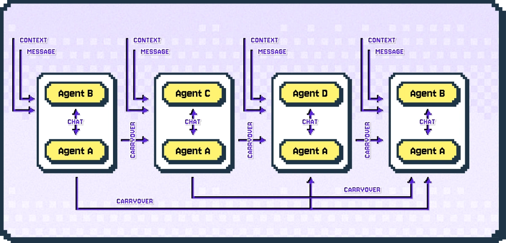
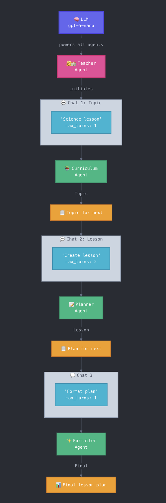

As a sequence of chats between two agents chained together by a mechanism called *carryover*, the sequential chat pattern is useful for complex tasks that can be broken down into interdependent sub-tasks.

### Understanding the Sequential Chat Pattern

The figure below illustrates how this pattern works.



In this pattern, a pair of agents start a two-agent chat, then the summary of the conversation becomes a *carryover* for the next two-agent chat. The next chat passes the carryover to the `carryover` parameter of the context to generate its initial message.

Carryover accumulates as the conversation moves forward, so each subsequent chat starts with all the carryovers from previous chats.

The figure above shows distinct recipient agents for all the chats, however, the recipient agents in the sequence are allowed to repeat.

### Building a Sequential Workflow

To illustrate this pattern, let's create a sequential workflow to create our lesson plan for the fourth grade class.

A teacher agent will engage three agents sequentially:

1. A curriculum designer will select a topic given the subject from the teacher
2. A lesson planner will design the lesson with two iterations given feedback from the teacher
3. A formatter will format the lesson



```python
from autogen import ConversableAgent, LLMConfig
from dotenv import load_dotenv
import os
load_dotenv()

llm_config = LLMConfig(config_list={"api_type": "openai", "model": "gpt-5-nano","api_key":os.getenv("OPENAI_API_KEY")})

# Three chats:
# 1. Teacher and Curriculum designer > summary is a topic for next chat
# 2. Teacher and Lesson planner (with 1 revision) > summary is lesson plan for next chat
# 3. Teacher and Formatter > summary is a formatted lesson plan

# Curriculum designer
curriculum_message = """You are a curriculum designer for a fourth grade class. Nominate an appropriate a topic for a lesson, based on the given subject."""

# Lesson planner
planner_message = """You are a classroom lesson agent.
Given a topic, write a lesson plan for a fourth grade class in bullet points. Include the title, learning objectives, and script.
"""

# Formatter
formatter_message = """You are a lesson plan formatter. Format the complete plan as follows:
<title>Lesson plan title</title>
<learning_objectives>Key learning objectives</learning_objectives>
<script>How to introduce the topic to the kids</script>
"""

# Teacher who initiates the chats
teacher_message = """You are a classroom teacher.
You decide topics for lessons and work with a lesson planner, you provide one round of feedback on their lesson plan.
Then you will work with a formatter to get a final output of the lesson plan.
"""

lesson_curriculum = ConversableAgent(
    name="curriculum_agent",
    system_message=curriculum_message,
    llm_config=llm_config,
)

lesson_planner = ConversableAgent(
    name="planner_agent",
    system_message=planner_message,
    llm_config=llm_config,
)

lesson_formatter = ConversableAgent(
    name="formatter_agent",
    system_message=formatter_message,
    llm_config=llm_config,
)

teacher = ConversableAgent(
    name="teacher_agent",
    system_message=teacher_message,
    llm_config=llm_config,
)

# Our sequential chat, each chat is a chat between the teacher and the recipient agent
# max_turns determines if there's back and forth between the teacher and the recipient
# max_turns = 1 means no back and forth
chat_results = teacher.initiate_chats(
    [
        {
            "recipient": lesson_curriculum,
            "message": "Let's create a science lesson, what's a good topic?",
            "max_turns": 1,
            "summary_method": "last_msg",
        },
        {
            "recipient": lesson_planner,
            "message": "Create a lesson plan.",
            "max_turns": 2, # One revision
            "summary_method": "last_msg",
        },
        {
            "recipient": lesson_formatter,
            "message": "Format the lesson plan.",
            "max_turns": 1,
            "summary_method": "last_msg",
        },
    ]
)

# The result of `initiate_chats` is a list of chat results
# each chat result has a summary
print("\n\nCurriculum summary:\n", chat_results[0].summary)
print("\n\nLesson Planner summary:\n", chat_results[1].summary)
print("\n\nFormatter summary:\n", chat_results[2].summary)
```

<Example/>

### Customizing Chat Behavior

The sequential chat is triggered by the teacher agent's `initiate_chats` method, which takes a list of dictionaries where each dictionary represents a chat between the teacher and the `recipient` agent.

The maximum number of turns in each chat can be controlled with the `max_turns` key. Each chat can also terminate before the `max_turns`, see the [Ending a Chat](orchestration/ending-a-chat.md) topic for further information.

The result of the `initiate_chats` method returns a list of `ChatResult` objects, one for each chat in the sequence.

### Different senders

In the above example, the teacher agent was the sender in each chat, however you can use the high-level `initiate_chats` function to start a sequence of two-agent chats with different sender agents. See this [notebook](../../use-cases/notebooks/notebooks/agentchat_sequential_chats.md#example-1-solve-tasks-with-a-series-of-chats) for an example.
