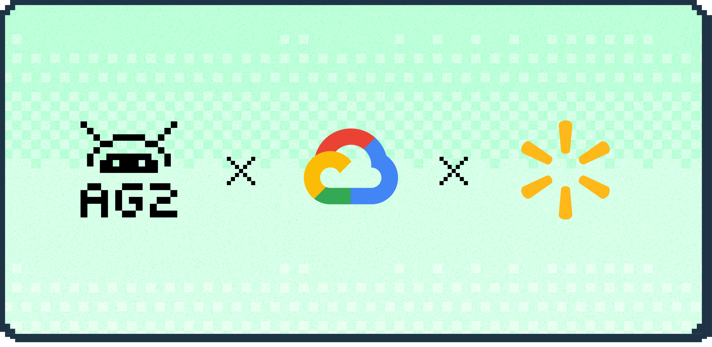

Author:

    

      

        
      

      

        

        

      

    

At Google Cloud Next 2025, Jason Cho, Director of Data Science at Walmart, gave an inside look at how his team is using AG2 with Vertex AI to build and deploy open-source AI agents in production.

The talk highlights how Walmart tackled real-world orchestration challenges, the lessons learned along the way, and how AG2 played a key role in turning autonomous workflows into reality.

The full session is available to watch below:

  <iframe
    class="w-full aspect-video rounded-md"
    src="https://www.youtube.com/embed/piz7XImNLfk?si=-xBPS9qGhWFNdngV&amp;start=1732"
    title="YouTube video player"
    frameborder="0"
    allow="accelerometer; autoplay; clipboard-write; encrypted-media; gyroscope; picture-in-picture; web-share"
    referrerpolicy="strict-origin-when-cross-origin"
    allowfullscreen
  ></iframe>

